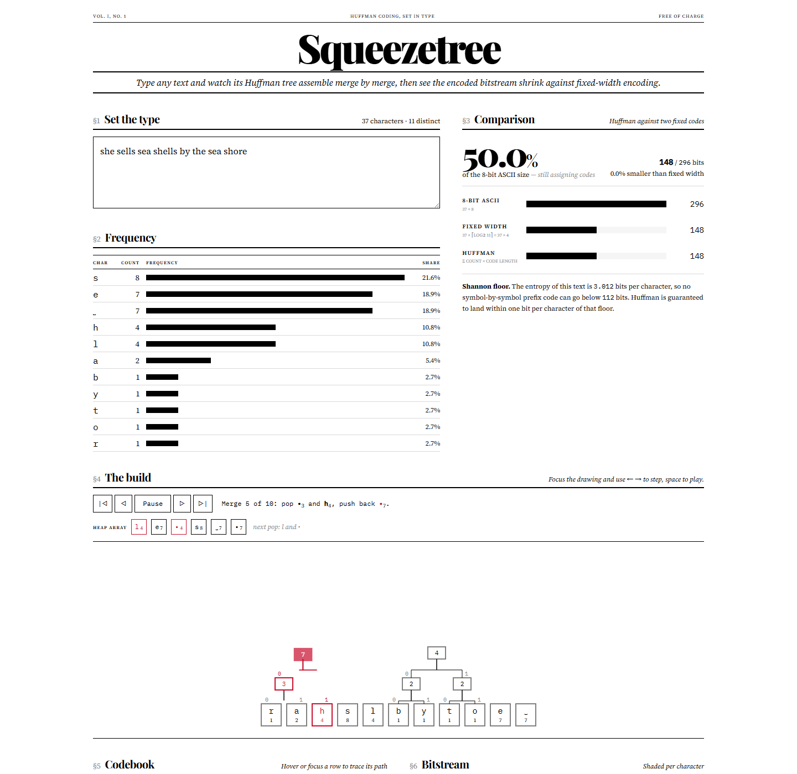

# Squeezetree

Type any text and watch its Huffman tree assemble merge by merge, then see the encoded
bitstream shrink against fixed-width encoding.



Set in the style of a broadsheet: white paper, black ink, one red for the node being merged.

## Features

- **Live frequency table** — rows re-sort themselves and bars stretch as you type.
- **Step-through construction** — a hand-written binary min-heap pops the two lightest
  nodes, merges them and pushes the parent back. Play, pause, step, or scrub with the
  arrow keys; the heap array is shown at every step with the next two pops marked.
- **Codebook** — prefix-free codes, bit lengths and each character's share of the total.
- **Bitstream** — the encoded text shaded per character; hover a chunk (or a codebook row)
  to trace its path down the tree.
- **Decode panel** — paste bits, walk the tree, recover the text. Invalid symbols and
  truncated codes are reported with the offending position marked.
- **Comparison** — Huffman bits vs fixed-width `ceil(log2(alphabet))` bits vs 8-bit ASCII,
  with the ratio and the Shannon entropy floor for reference.
- **Canonical Huffman toggle** — the same lengths, with codes rebuilt from the lengths alone
  and the tree redrawn to match; decoding switches to the canonical tree too.

The bit counter is honest about timing: before a character's code is assigned it is
charged at fixed width, so the total visibly ticks down as the depth-first walk hands
out codes after the last merge.

## How it works

Everything in `src/huffman/` is from scratch. `frequencies` counts symbols by code point
in first-seen order. `buildTree` pushes one leaf per symbol into a `MinHeap` keyed on
weight, with ties broken by creation order (leaves first, then merged nodes in merge
order) so the same text always yields the same tree. While more than one node remains
it pops two, links them under a fresh parent — the lighter on the `0` side — sets parent
pointers, and pushes the parent back. Each `MergeStep` records the pair, the parent and a
snapshot of the heap array, which is what the transport controls scrub through.

```
"abracadabra"   a:5  b:2  r:2  c:1  d:1        (heap arrays shown in array order)

heap [c1 d1 r2 a5 b2]   pop c1, d1   -> •2      heap [b2 •2 r2 a5]
heap [b2 •2 r2 a5]      pop b2, r2   -> •4      heap [•2 a5 •4]
heap [•2 a5 •4]         pop •2, •4   -> •6      heap [a5 •6]
heap [a5 •6]            pop a5, •6   -> •11     done

           11                a = 0       (5 x 1 bit)
          0/  \1             c = 100     (1 x 3)
          a    6             d = 101     (1 x 3)
             0/ \1           b = 110     (2 x 3)
             2   4           r = 111     (2 x 3)
           0/ \1 0/ \1                   = 23 bits, vs 33 fixed-width, vs 88 ASCII
           c  d  b  r
```

`assignCodes` walks the finished tree depth-first, appending `0` for a left branch and
`1` for a right one; a single distinct symbol gets the code `0` so it still costs one bit
per occurrence. `decode` walks the same tree bit by bit, emitting a symbol at every leaf
and throwing a `DecodeError` (with the bit index) on anything other than `0`/`1` or on a
stream that ends mid-code.

The canonical form keeps only the code *lengths*: sort symbols by (length, symbol),
start at `0`, add one for each symbol and shift left whenever the length grows. Because
the lengths are unchanged the total bit count is identical, but the table can now be
transmitted as a list of small integers. `treeFromCodes` rebuilds a decoding tree from
any prefix-free codebook so the canonical bitstream decodes the same way.

## Run

```sh
npm install
npm run dev       # local dev server
npm run build     # type-check and bundle to dist/
npm test          # vitest: heap, huffman, canonical codes, timeline model
```

## Tech

Vite 8, React 19, TypeScript (strict), Tailwind CSS 4, Vitest 5. Type set in Playfair
Display, Source Serif 4 and IBM Plex Mono via `@fontsource`. The tree is a plain SVG with
orthogonal connectors and CSS animations — no charting or animation libraries.

## License

MIT — see [LICENSE](LICENSE).
